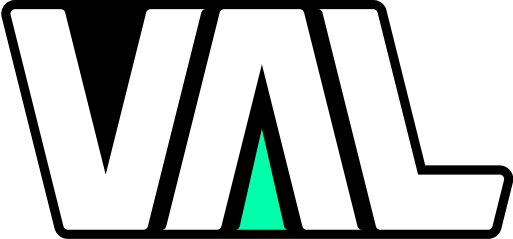

	

	
	
	

# About
Val is a simple, lightweight state container library for Roblox & Luau. Inspired by reactive programming, Val allows you to observe values so that you can automate processes for value changes.

## Why Val?
- Zero dependencies (source code is just a single file!)
- Easy/simple API that minimizes verbosity
- Focused on general purpose state reactivity rather than UI exclusively

## Features
You can go over these features in-depth in the [documentation](https://tumblewede.github.io/Val/docs/introduction).
- Computeds
- Observers
- Scopes
- Batched updates
- Memory management
- Built-in arithmetic & string operations
- Strict type-safety
- (Near) full customization of states